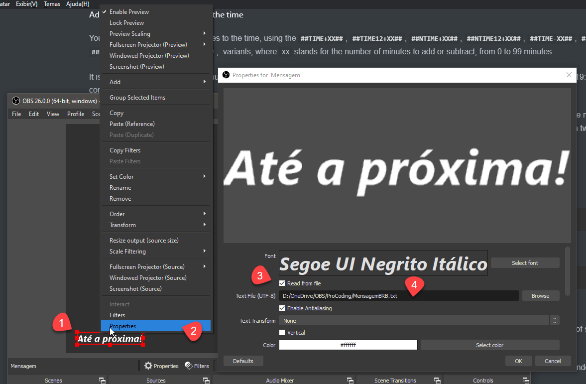
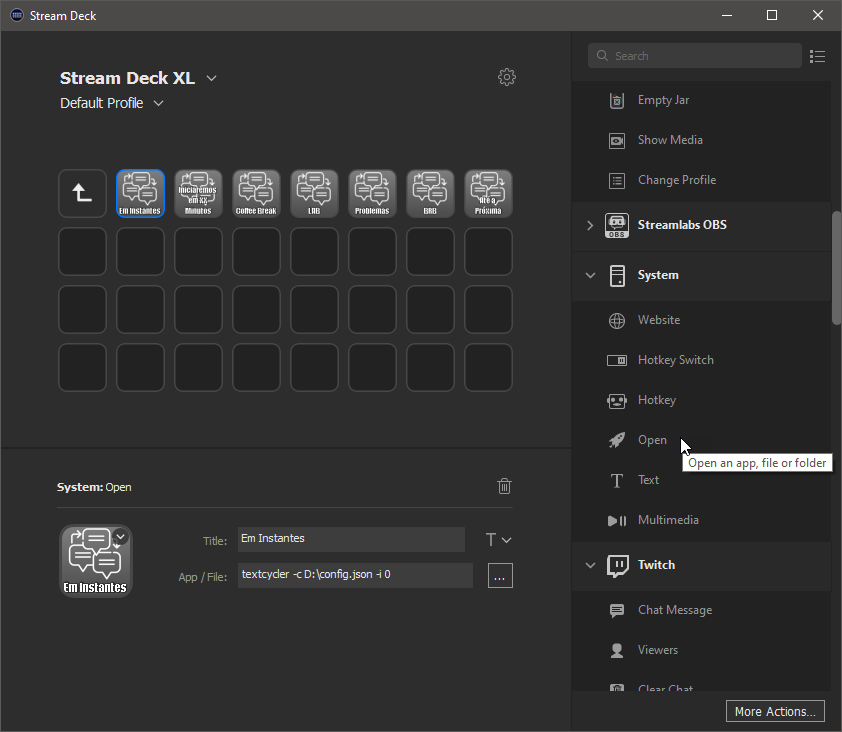

[](https://badge.fury.io/nu/textcycler)[](https://sonarcloud.io/dashboard?id=Robson-Rocha_TextCycler)


# TextCycler 
TextCycler is a simple yet powerful command line tool for cycling texts and perform some sequence and time replacements on the text, useful for OBS Streamings, or in any application which you can read the value of a text file (and is capable of detecting the changes of the text file).

**Table of Contents:**

- [Requirements](#requirements)
- [Installation](#installation)
- [Usage](#usage)
  - [Creating the JSON config file](#creating-the-json-config-file)
  - [Setting your texts in the config file](#setting-your-texts-in-the-config-file)
    - [Overriding `nextTextIndex`](#overriding-nexttextindex) 
    - [Entering text manually](#entering-text-manually)
    - [Selecting the text index in a menu](#selecting-the-text-index-in-a-menu)
    - [Overriding `targetFile`](#overriding-targetfile)
  - [Using Sequence Replacement Tokens](#using-sequence-replacement-tokens)
    - [Overriding a sequence value](#overriding-a-sequence-value)
  - [Using Time Replacement Tokens](#using-time-replacement-tokens)
    - [Adding or subtracting minutes to the time](#adding-or-subtracting-minutes-to-the-time)
    - [Overriding the current time](#overriding-the-current-time)
  - [Using Variable Replacement Tokens](#using-variable-replacement-tokens)
    - [Default values](#default-values)
    - [Using explicit values for variables](#using-explicit-values-for-variables)
  - [Using Auto Cycling](#using-auto-cycling)
  - [Delaying the result message](#delaying-the-result-message)
  - [Usage with OBS](#usage-with-obs)
  - [Automating text changes](#automating-text-changes)
    - [Using StreamDeck](#using-streamdeck)
    - [Using Hot Keys](#using-hot-keys)

## Requirements

TextCycler is a .NET Core Global Tool, and as such, can be used in any platform where you can install .NET Core 3.1 (Windows, MacOS and Linux).
To install .NET Core 3.1, [click here](https://dotnet.microsoft.com/download/dotnet-core/3.1).

## Installation

To install TextCycler, in your preferred terminal, use the following command:

```bash
dotnet tool install -g TextCycler
```

You can check at NuGet.org for the current version [clicking here](https://www.nuget.org/packages/TextCycler).

To ensure you are running the latest version, you can run the following command to update TextCycler:

```bash
dotnet tool update -g TextCycler
```

## Usage

### Creating the JSON config file

After installation, and before you can use TextCycler, you'll need to create a JSON config file. You can create a starter template with the following command in your preferred terminal:

```bash
textcycler -c config.json --generateConfig
```

This will create a config.json file in the current directory.

You can specify the full path of the config.json in the `-c` or `--configFile` option, and it can have any name you prefer. Think of this config file as a 'Profile', in which you can have multiple profiles for different occasions.

It's recommended that you save this config file in an easily accessible path.

The initial config file looks like the following:

```json
{
 "texts": [
  "First text",
  "Second text, with Current Time (#TIME#), and Rounded to Nearest 5 Minutes Time (#NTIME#)",
  "Third Text, with the sequence 0 (#SEQUENCE_00#) from 01 to 05",
  "Fourth Text, with the sequence 1 (#SEQUENCE_01#) using text values"
 ],
 "sequences": [
  [
   "01",
   "02",
   "03",
   "04",
   "05"
  ],
  [
   "lorem",
   "ipsum",
   "dolor"
  ]
 ],
 "targetFile": "targetfile.txt"
}
```

### Setting your texts in the config file

TextCycler works setting the text in one of the array entries in the `"texts"` section into the file specified in the `"targetFile"` section, each time you use the following command:

```bash
textcycler -c config.json
```

Each text must be into a string into the array, and you should escape unsupported JSON characters accordingly.

In the above command, the `-c` or `--configFile` option indicates the path to the config file.

TextCycler will create a  `"nextTextIndex"` section in the config file, that determines which text will be written the next time you execute TextCycler, starting with `0` for the first text and `n-1` for the nth text, and will be automatically be updated by TextCycler at each execution. When the last text is written, it will reset to `0`.

This way, given the above configuration files, executing TextCycler three times will output the following texts to the `targetFile` after each execution:

```
First text
```

```
Second text, with Current Time (19:03), and Rounded to Nearest 5 Minutes Time (19:05)
```

```
Third Text, with the counter 0 (01) from 1 to 5
```

We will discuss about the sequence replacement tokens and time replacement tokens shortly.

#### Overriding `nextTextIndex` 

If you want to write a specific text index to the `targetFile`, you can use the `-i` or `--index` option to specify the desired text index:

```bash
textcycler -c config.json -i 1
```

Which, given the above configuration file, will output the following text to the `targetFile`:

```
Second text, with Current Time (19:03), and Rounded to Nearest 5 Minutes Time (19:05)
```

Overriding the text index does not change the next text index.

#### Entering text manually

In cases that you need to set some text ad-hoc, you can use the `-p` or `--prompt` option. TextCycler will ask on the console for the desired text. This is useful when you need to display some unplanned text.

```bash
textcycler -c config.json -p
```

```
Enter your text: Lorem ipsum dolor
```

```
The text 'Lorem ipsum dolor' was written to 'targetfile.txt'
```

The default text for the `-p` will always be the last text generated using the config file, as TextCycler will save it in the `"lastWrittenText"` section in the config file. If you want to clear the text, just erase it, or press `ESC` or `CTRL+L`.

You cannot combine the `-p` / `--prompt` option with `-m` / `--menu` or `-a` / `--autoCycle` options.

#### Selecting the text index in a menu

If you don't know what to choose, or can't remember the index of the text you want, you can use the -m or --menu option to display a list of the texts in the config file, and then select the desired text:

```bash
textcycler -c config.json -m
```

```
[0] First text
[1] Second text, with Current Time (#TIME#), and Rounded to Nearest 5 Minutes Time (#NTIME#)
[2] Third Text, with the sequence 0 (#SEQUENCE_00#) from 01 to 05
[3] Fourth Text, with the sequence 1 (#SEQUENCE_01#) using text values
[#] [Enter a custom text]

Enter the desired index: 0
```

```
The text 'First text' was written to 'targetfile.txt'
```

The default index will be the last text index used with the menu. You can cycle between the index values using the `up arrow` and `down arrow` keys.

If no option match your needs, you can select the `#` option and enter a custom text.

Selecting the text index with the menu does not change the next text index.

You cannot combine the `-m` / `--menu` option with `-p` / `--prompt` or `-a` / `--autoCycle` options.

#### Overriding `targetFile`

If you want to override the targetFile section, or simply prefer to provide its path in the command line, you can use the `-f` or  `--targetFile` option:

```bash
textcycler -c config.json -f somefile.txt
```

### Using Sequence Replacement Tokens

Sequences are a useful feature which allow you to use sequences of text, which will be applied in sequentially each time a text is written to the target file.

The configuration file shown above depicts a `"sequences"` section, which consists of an array of text arrays. Each text array represents the texts that will be replaced in the text, using a special **`#SEQUENCE_NN#`** Sequence Replacement Token in the text, where `NN` stands for the index of the sequence value. As each index always start with zero, you can provide up to 100 values for each sequence. The values of a sequence can be any text.

For example, the third text in the above configuration file includes the `#SEQUENCE_00#` Sequence Replacement Token, which represents the value for the first sequence of values. If you execute the command below three times, to write specifically the third text to the target file:

```bash
textcycler -c config.json -i 3
```

It will produce the following texts after each time the TextCycler is executed:

```
Third Text, with the sequence 0 (01) from 01 to 05
```

```
Third Text, with the sequence 0 (02) from 01 to 05
```

```
Third Text, with the sequence 0 (03) from 01 to 05
```

The same will apply if you simply cycle through all the texts. Each time that the `#SEQUENCE_00#` is replaced, it will get the next value in the sequence, going back to the first value after the last value is replaced.

It is important to note that the sequence cycling occurs only after all the replacements. So using the same replacement token multiple times in the same text will produce the same value.

To control the current index of the sequences, TextCycler will create a `"sequencePositions"` in the config file. This section will be automatically recreated if you change the number of sequences in your config file.

#### Overriding a sequence value

You can override a sequence value using the `-s` or `--sequenceValue` option, providing the index of the sequence to be overriden and the value to override, separated by a comma, as in the following example:

```bash
textcycler -c config.json -i 3 -s 0,99
```

Which will produce the following text:

```
Third Text, with the sequence 0 (99) from 01 to 05
```

Overriding a sequence value does not change the next index for the sequence.

If you need to place a comma in the sequence text, use `\,` to escape it, otherwise you'll get an error.

### Using Time Replacement Tokens

Time Replacement Tokens are useful to output the current time into the written text. 

There are two time basic replacement tokens: **`#TIME#`**, which outputs the current time in the 24 hours format, and **`#TIME12#`**, which outputs the current time in 12 hours format (including AM/PM).

If you want the time to be rounded to the nearest 5 minutes, you can use the **`#NTIME#`** and **`#NTIME12#`** variants.

#### Adding or subtracting minutes to the time

You can also add or subtract minutes to the time, using the **`#TIME+X#`**, **`#TIME12+X#`**, **`#NTIME+X#`**, **`#NTIME12+X#`**, **`#TIME-X#`**, **`#TIME12-X#`**, **`#NTIME-X#`** and **`#NTIME12-X#`**,  variants, where `X` stands for the number of minutes to add or subtract.

It is useful in situations when you must consider a different time zone, or wants to generate a message like "Live Transmission will start at 19:00!", based on your computer time.

You can even combine the Time Replacement Tokens with the Sequence Replacement Tokens, i.e. **`#NTIME+#SEQUENCE_00##`**, where the number of minutes to be added comes from the replacement token **`#SEQUENCE_00#`**, as the Sequence Replacement Tokens are processed before the Time Replacement Tokens. Pay attention to the hash count, every replacement token starts with one hash and end with another one, and that the sequence value must be numeric, or else the time replacement token could not be recognized.

#### Overriding the current time

If you do not want to use the current time, but set a specific time instead, you can use the `-t` or `--time` to set the specific time:

```bash
textcycler -c config.json -i 1 -t 19:00
```

The time can also be set in 12 hours format:

```bash
textcycler -c config.json -i 1 -t 7:00PM
```

### Using Variable Replacement Tokens

TextCycler supports passing variable values, which in turn can be used as Variable Replacement Tokens. They are processed before any other replacement tokens, so can be combined with Sequence Replacement Tokens and Time Replacement Tokens.

Supposing you have the following text at the first position in the `texts` section in the config file: 

```json
"I`ll be back in #MINS# minutes!"
```

Notice that it declares a `#MINS#` replacement token. This is our variable. To pass a value to it, use the `-v` or `--variable` option. This will make TextCycler prompt for the value of the variable:

```bash
textcycler -c config.json -i 0 -v MINS
```

```
Enter the value for #MINS#: 15
The text 'I`ll be back in 15 minutes!' was written to 'targetFile.txt'
```

You can provide as many variables as you want, just use the `-v` or `--variable` option multiple times, one for each variable.

If you need to place a colon in the variable name, use `\:` to escape it, otherwise you may get wrong results.

#### Default values

You can provide a default value for a variable using a `:` separator after the variable name. It will be displayed at the prompt, and you can edit it or clear it with `ESC` or `CTRL+L`:

```bash
textcycler -c config.json -i 0 -v MINS:30
```

```
Enter the value for #MINS#: 30
The text 'I`ll be back in 30 minutes!' was written to 'targetFile.txt'
```

If you need to place a colon in the default value, use `\:` to escape it, otherwise you may get wrong results.

#### Using explicit values for variables

Supposing you don't want TextCycler to ask the value for a variable, but instead provide it explicitly. In this case, you can use the `-vv` or `--variableValue` option:

```bash
textcycler -c config.json -i 0 -vv MINS:45
```

```
The text 'I`ll be back in 45 minutes!' was written to 'targetFile.txt'
```

### Using Auto Cycling

Supposing that you want to continuously cycle through your list of texts, you can use the `-a` ou `--autoCycle` option to specify an interval of seconds between cyclings. 

The following command will write each text in the config file at every 60 seconds, until you press the break key combination (`CTRL+C` in windows).

```bash
textcycler -c config.json -a 60
```

You can use the `-a` or `--autoCycle` option in combination with all other options except for `-m` / `--menu` and `-p` / `--prompt`. 

### Delaying the result message

If you want the result message to hold the terminal open for a few seconds after TextCycler do its job, say, to make time for you to read its output, you can use the `-d` or `--delay` option, providing the number of seconds you want to delay the termination of TextCycler:

```
textcycler -c config.json -d 5
```

The above command will show the next text, and keep waiting for five seconds before termination.

## Usage with OBS

In [OBS](https://obsproject.com/), you can set the source of any text element to a text file. OBS always "watches" for content changes in the file every second or so.



1. Add a `Text (GDI+)` source to your scene
2. Right-click the text source, and click `Properties`
3. At the properties window, check the `Read from File` option
4. Click `Browse` and select the text file that will provide the text for your `Text (GDI+)` source. Be sure to use the same path of the `"targetFile"` you provided in TextCycler
5. Click `OK`

Now, every time you change the text in the text file you provided at step 4 using TextCycler, it will automatically refresh your scene with the updated text. 

Keep in mind that OBS can take one second or so to update the `Text (GDI+)` source with the written text.

## Automating text changes

Being a simple console application, TextCycler will only do half of the job: you'll still need a convenient way to run it while you are streaming. But it is simple enough to be easy to integrate in multiple ways.

### Using StreamDeck

[StreamDeck](https://www.elgato.com/stream-deck) is a perfect option to trigger the text cycling or transformations. With StreamDeck, you can use the "System > Open" action to run TextCycler. Just be sure to use the full path of the config file in the `-c` option and in the `targetFile` or `-f` option for the target file.



If you want to customize the button icon, you can use this icon:


### Using Hot Keys

You can create hotkeys in many ways. In Windows you can resource to .lnk files (Shortcut Files), but it is cumbersome to create and mantain. A great approach is to use a "hotkey automator" tool like those below. They can require some configuration, but usually launch an application is a trivial task.

- [AutoHotKey (Windows)](https://www.autohotkey.com/)
- [HammerSpoon (Mac)](http://www.hammerspoon.org/)
- [AutoKey (Linux)](https://github.com/autokey/autokey)
